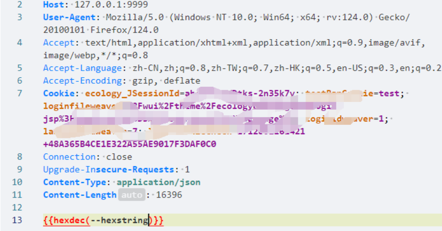

## Weaver Ecology 8.0 unserial Vulnerability Notes

 :one: Select website and Using Weak password  Enter background.(Local Build)

:two:Use burpsuite to capture request and Change to a path with vulnerabilities

:three:Use ysoserial to generate payload and Hexadecimal encryption

:four: Use Yakit  to forward request .

:five: result.

